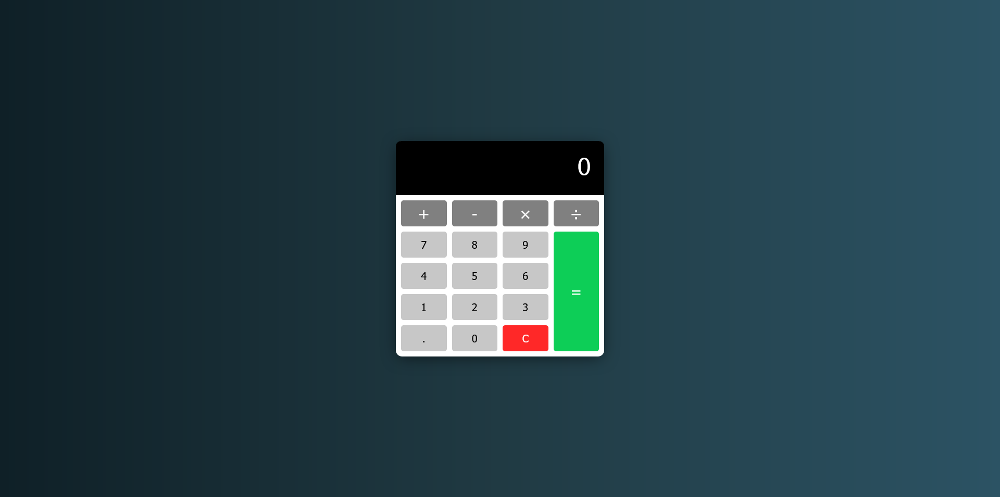

# Calculator

The Calculator project is a functional and visually appealing web-based calculator. Built with HTML, CSS, and JavaScript, it offers essential arithmetic operations and a user-friendly interface, replicating the functionality of a physical calculator.

This project was developed as part of the course "JavaScript Web Projects: 20 Projects to Build Your Portfolio" by Zero To Mastery.

## Table of contents

- [Calculator](#calculator)
  - [Table of contents](#table-of-contents)
  - [Overview](#overview)
    - [Screenshot](#screenshot)
    - [Links](#links)
    - [Built with](#built-with)
    - [What I learned](#what-i-learned)
    - [Useful resources](#useful-resources)
  - [Author](#author)
  - [Acknowledgments](#acknowledgments)

## Overview

The Calculator project provides a simple yet effective tool for performing basic calculations. Users can:
- Perform addition, subtraction, multiplication, and division operations.
- Chain calculations seamlessly with operator precedence.
- Clear the current input or reset the entire calculation.

### Screenshot



### Links

- Live Site URL: [DT Code](https://calculator.dtcode.se/)

### Built with

- HTML5: Provides the semantic structure for the calculator layout.
- CSS3:
  - Modern styling with gradients and hover effects.
  - Responsive design, adapting seamlessly to various screen sizes.
- JavaScript (ES6+):
  - Event-driven functionality for dynamic user interactions.
  - Arithmetic logic implemented using JavaScript objects for cleaner code.

### What I learned

This project helped me enhance my skills in:
- Dynamic UI Updates: Using JavaScript to dynamically update the display and handle user inputs.
- Event Handling: Implementing event listeners for various button actions (numbers, operators, and special keys).
- Arithmetic Logic: Creating a reusable calculate object for handling arithmetic operations.
- Responsive Design: Ensuring the calculator is usable on both mobile and desktop devices.

The following code snippet demonstrates how the calculator processes user input and updates the display:

```js
function useOperator(operator) {
    const currentValue = Number(calculatorDisplay.textContent);
    if (operatorValue && awaitingNextValue) {
        operatorValue = operator;
        return;
    }
    if (!firstValue) {
        firstValue = currentValue;
    } else {
        const calculation = calculate[operatorValue](firstValue, currentValue);
        calculatorDisplay.textContent = calculation;
        firstValue = calculation;
    }
    awaitingNextValue = true;
    operatorValue = operator;
}
```

### Useful resources

- [MDN Web Docs: Handling Events](https://developer.mozilla.org/en-US/docs/Learn/JavaScript/Building_blocks/Events) - Helped implement dynamic event handling for calculator buttons.
- [MDN Web Docs: CSS Grid Layout](https://developer.mozilla.org/en-US/docs/Web/CSS/CSS_grid_layout) - Guided the creation of the responsive button grid.
- [MDN Web Docs: JavaScript Number Object](https://developer.mozilla.org/en-US/docs/Web/JavaScript/Reference/Global_Objects/Number) - Provided insights into JavaScript's number manipulation capabilities.

## Author

- GitHub - [@dantvi](https://github.com/dantvi)
- LinkedIn - [@danieltving](https://www.linkedin.com/in/danieltving/)

## Acknowledgments

Special thanks to Zero To Mastery for providing structured learning material, and to MDN Web Docs for their detailed and easy-to-understand technical documentation.
